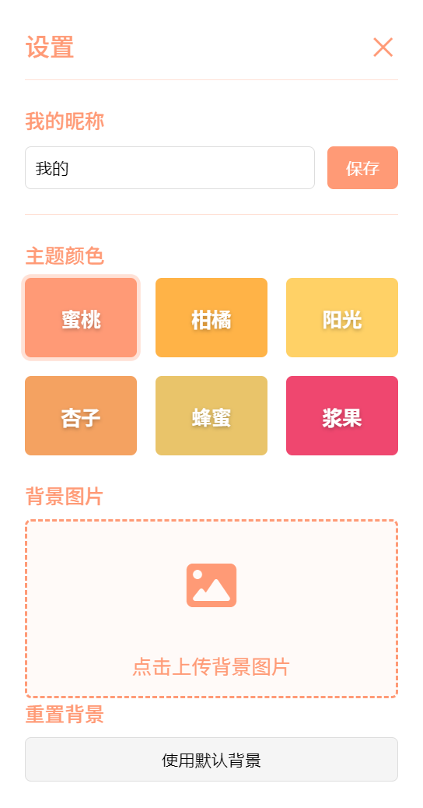

# ✈️ 旅行日记 - 暖心旅行记录平台


> "世界是一本书，不旅行的人只读了一页" —— 圣奥古斯丁

## 🌟 项目简介

**旅行日记** 是一款温暖治愈的旅行记录Web应用，专为热爱生活的旅行者设计！在这里，你可以：

- 📸 记录每一次旅行的美好瞬间
- 🎵 为旅行添加专属BGM
- 🎨 自定义个性化主题
- ✨ 享受精美的视觉设计和交互体验

## 🛠️ 技术栈

| 技术 | 用途 | 表情 |
|------|------|------|
| HTML5 | 页面结构 | 🔧 |
| CSS3 | 样式设计 | 🎨 |
| JavaScript | 交互逻辑 | 🧠 |
| LocalStorage | 数据存储 | 💾 |
| 网易云音乐API | 音乐播放 | 🎵 |

## 🎯 核心功能

### 1. ✈️ 旅行记录
- 添加旅行地点、日期
- 上传多张旅行照片
- 撰写旅行故事
- 自动保存到本地

### 2. 🎵 旅行音乐
- 搜索添加旅行专属BGM
- 内置多首经典旅行歌曲
- 点击即可播放

```javascript
// 示例音乐数据
const travelMusic = {
  title: "旅行的意义",
  artist: "陈绮贞",
  url: "https://music.163.com/song/media/outer/url?id=386538.mp3"
}
```

### 3. 🎨 个性化设置
- 6种温暖主题色可选
- 自定义背景图片
- 设置个人昵称

### 4. ✨ 特色功能
- 旅行语录随机展示（带打字机效果）
- 图片轮播展示
- 响应式设计，适配各种设备
- 流畅的动画过渡效果

## 🚀 快速开始

1. **克隆仓库**
   ```bash
   git clone https://github.com/Florence-W/TravelLogs.git
   ```
[➡️ 立即体验](https://Florence-W.github.io/TravelLogs/) 

2. **直接运行**
   - 打开`index.html`文件即可

3. **开始记录**
   - 点击"添加新旅行"按钮
   - 填写旅行信息
   - 上传照片
   - 保存！

## 📸 界面预览

| 功能 | 截图 |
|------|------|
| 主界面 |  |
| 添加旅行 |  |
| 设置 |  |

## 🌈 设计理念

> "旅行不是为了到达目的地，而是为了享受沿途的风景"

我们设计了温暖的色彩搭配和流畅的交互，希望带给用户：

- 🧘‍♀️ 轻松愉悦的使用体验
- 🎨 视觉上的舒适感
- 💖 记录美好回忆的仪式感

## 🤝 参与贡献

欢迎提交PR！我们特别需要：

- 🐛 Bug修复
- 💡 新功能建议
- 🌍 多语言支持
- 📱 移动端优化

## 📜 开源协议

MIT License - 自由使用，请保留原作者信息

---

Made with ❤️ by [Florence-W] | ✈️ 记录每一段美好旅程
```